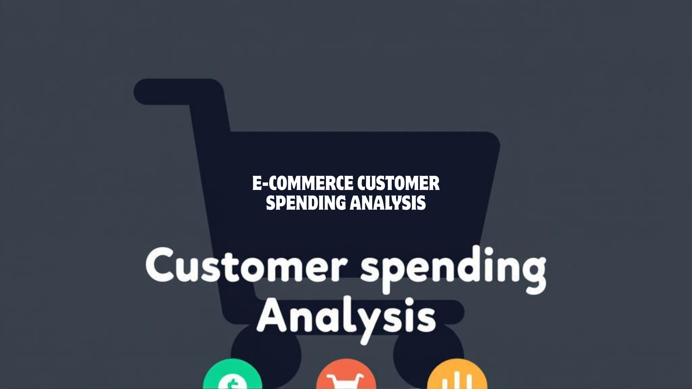
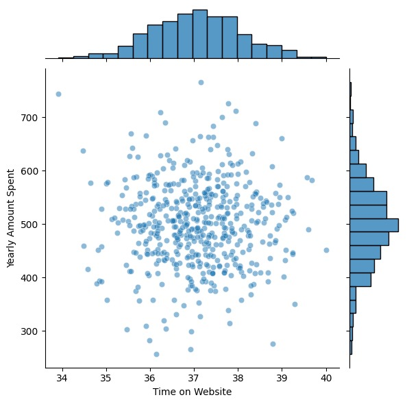
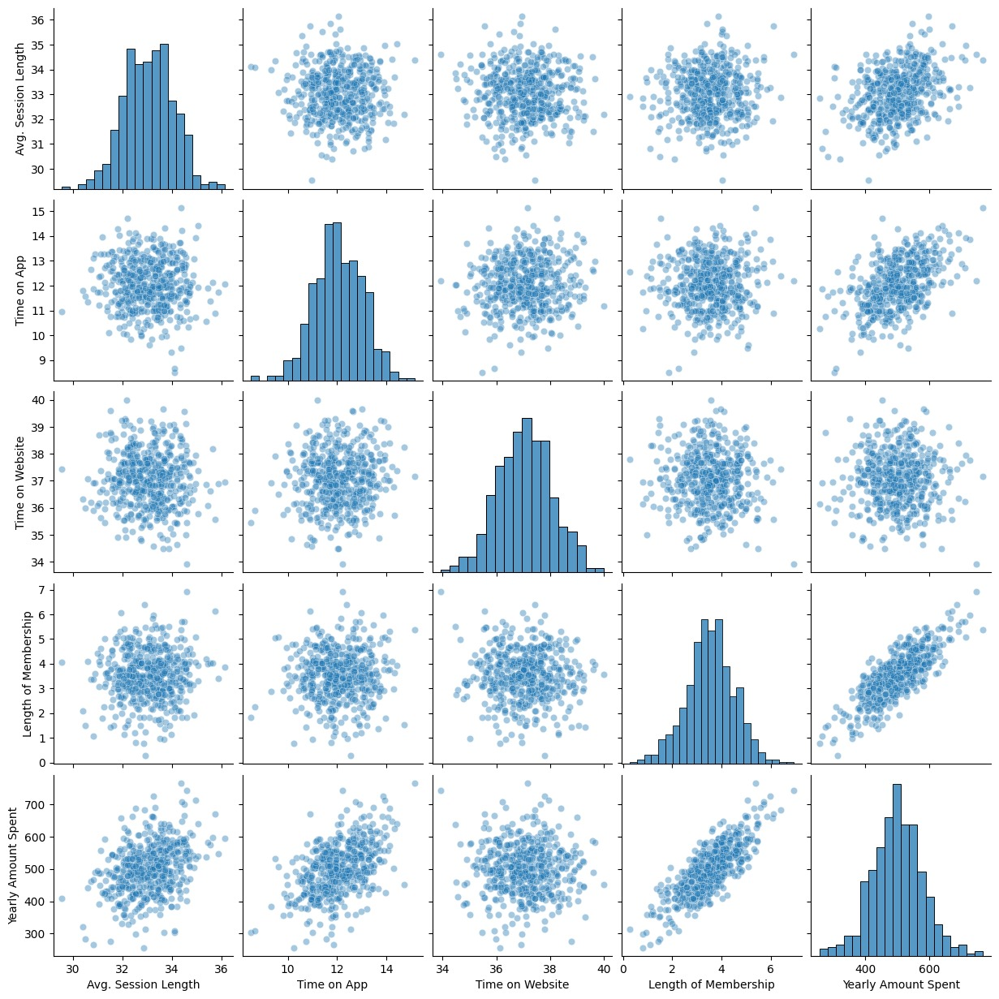
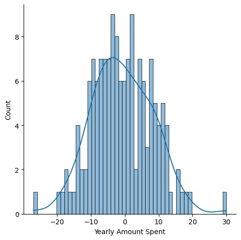

🛒 E-commerce Customer Spending Analysis


  [](https://www.python.org/)
  [](https://pandas.pydata.org/)
  [](https://numpy.org/)
  [](https://matplotlib.org/)
  [](https://seaborn.pydata.org/)
  [](https://jupyter.org/)
  

🤖 Introduction
-⚙️ Tech Stack
-🔋 Features
-🤸 Quick Start
-🕸️ Project Structure
-📊 Results / Visualizations
-📂 Screenshots
-🔗 Links

🤖 Introduction
Welcome to the E-commerce Customer Spending Analysis Project!
This project analyzes customer spending patterns in an e-commerce platform to:
- Understand purchasing behavior
- Identify high-value customers
- Detect spending trends across categories
Insights from this project can help improve marketing strategies, product recommendations, and revenue growth.

⚙️ Tech Stack
- Python 🐍
 Pandas, NumPy
- Matplotlib, Seaborn
- Jupyter Notebook
- 
🔋 Features
✅ Data Cleaning and Preprocessing (handling missing values, encoding)
✅ Exploratory Data Analysis (EDA) to understand spending patterns
✅ Visualization of top customers, categories, and trends
✅ Summary statistics of customer spending behavior
✅ Exported analysis reports (customer_spending_report.csv)
✅ Usable as both Notebook (spending_analysis.ipynb) and Script (spending_analysis.py)

🤸 Quick Start
Prerequisites
- Python 3.8+
- pip

### Installation
```bash git clone https://github.com/yourusername/ecommerce-customer-spending.git
cd ecommerce-customer-spending
pip install -r requirements.txt
```
### Running the Project

- Jupyter Notebook
```bash 
jupyter notebook spending_analysis.ipynb
```

- Python Script
``` bash
python spending_analysis.py
```
🕸️ Project Structure
ecommerce-customer-spending/
│── customer_data/               # Dataset
│── customer_spending_report.csv # Exported analysis
│── spending_analysis.ipynb      # Jupyter Notebook (EDA + analysis)
│── spending_analysis.py         # Python script
│── requirements.txt             # Dependencies
│── images/                      # Screenshots / visualizations
│── README.md                    # Documentation

📊 Results / Visualizations
- Top 10 customers by total spending
- Spending distribution across categories
- Monthly/seasonal spending trends
- Average order value and frequency
- Customer segmentation by spending tiers

📂 Screenshots
- EDA plots – histograms, boxplots, bar charts of spending per category
  
  
- Histogram of Prediction Residuals with Density Curve
  
- Actual vs Predicted Customer Spending
   
  
🔗 Links
📂 [Dataset](https://www.kaggle.com/datasets/kolawale/focusing-on-mobile-app-or-website)
📊 [Run on Colab](https://colab.research.google.com/drive/1tu1O03FCdX6mip3MKwEDNeX9s8B1ueG-?usp=sharing) 
